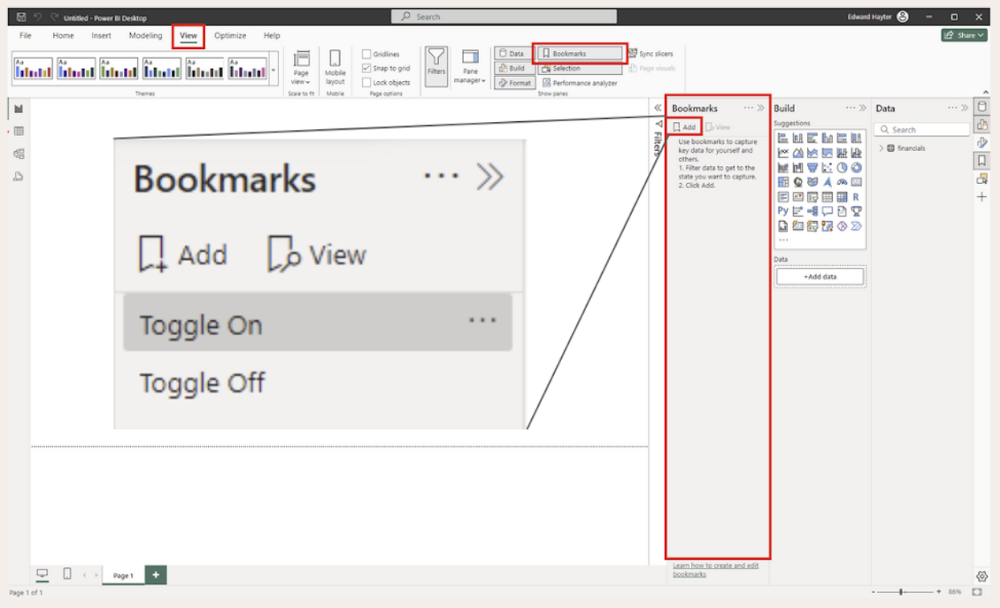
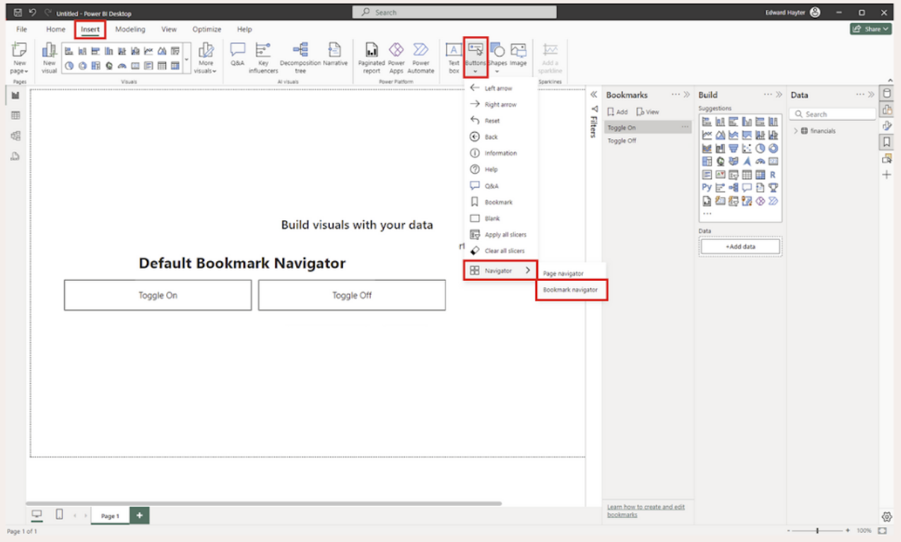
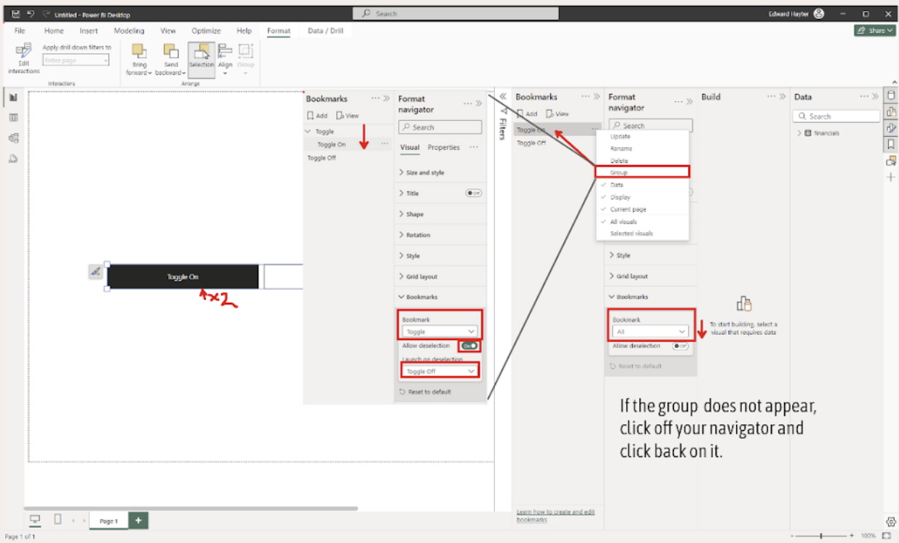

# README: Creating a Chart Swap Toggle in Power BI Using Bookmarks

This guide will walk you through the process of creating a chart swap toggle in Power BI using bookmarks. The process is broken down into two main parts: building the bookmark infrastructure and associating the bookmarks with specific displays.

## Table of Contents

1. [Setting Up Bookmarks](#setting-up-bookmarks)
2. [Creating a Toggle Button](#creating-a-toggle-button)
3. [Configuring the Button](#configuring-the-button)
4. [Finalizing Functionality](#finalizing-functionality)

## Setting Up Bookmarks

1. **Open the Bookmark Pane:**

   - Go to `View > Bookmarks` to ensure the bookmark pane is open.

2. **Create Bookmarks:**
   - Add two bookmarks named after your two states (e.g., `Slicers Shown` & `Slicers Hidden` or `Bar Chart Shown` & `Scatter Plot Shown`). For this example, we'll use `Toggle On` and `Toggle Off`.

## Creating a Toggle Button

1. **Insert a Button:**

   - Go to `Insert > Buttons > Navigate > Bookmark Navigator`.

2. **Configure the Navigator Button:**
   - By default, this will create a set of buttons to navigate between bookmarked states. For a chart toggle, we need a single button with specific configurations.

## Configuring the Button

1. **Format the Navigator:**

   - Inside the formatting options for the navigator, go to the `Bookmark` option. Here, you can specify that the navigator applies to a group of bookmarks.

2. **Grouping Bookmarks:**

   - In the bookmark pane, add one of the states to a group. Then, select the group from the dropdown in the formatting options. Note: The dropdown may not refresh immediately; click off the navigator and back on to reopen the formatting config.

3. **Enable Deselect Option:**

   - Enable the deselection option and select your other state to achieve the desired functionality—a single button that toggles between the two states.

4. **Customize Appearance:**
   - Update a bookmark name to a Unicode dot: ⬤. Use alignment, padding, shape, and fill options to customize the look. Set the default format first, then configure the selected format. Control-click the button to toggle between the two states and ensure the formatting is satisfactory.

## Finalizing Functionality

1. **Open the Selection Pane:**

   - Go to `View > Selection` to open the selection pane. This helps in easily selecting report items and toggling their visibility.

2. **Configure Bookmarks:**

   - Right-click on the bookmark to set configurations based on your use case. For cosmetic updates like a chart swap, disable the `Data` option to avoid saving filter setups in the bookmark.
   - Select `Apply to selected visuals` to control particular components of the report. This is generally the most effective option.

3. **Update Bookmarks:**

   - Select the bookmark to update, then hide/show the appropriate objects in the selection pane. Control-click the objects to be impacted by the bookmark, right-click, and update the bookmark.

4. **Set Current Page Option:**
   - The `Current page` option ensures that when a bookmark is selected via a button, you are taken to the page where the bookmark was originally created. In a multi-page report, this ensures users are redirected to the correct page.

## Summary

With the infrastructure in place, you can now focus on the functionality of your chart toggle. Using these steps, you can easily configure a seamless chart swapping experience in Power BI.

---

## Detailed Steps for Configuration

### Setting Up Bookmarks

1. **Ensure Bookmark Pane is Open:**

   - Navigate to `View > Bookmarks` to open the bookmark pane.

2. **Create Two Bookmarks:**

   - Click `Add` to create a bookmark for each state you want to toggle between. Name them descriptively, such as `Bar Chart Shown` and `Scatter Plot Shown`.

   

### Creating and Configuring the Toggle Button

1. **Insert a Bookmark Navigator Button:**

   - Go to `Insert > Buttons > Navigator > Bookmark Navigator`.

   

2. **Configuring Single Button Toggle:**

   - By default, multiple buttons will be created. To use a single button:
     - Go to the formatting pane, under `Navigator`, select `Bookmark`.
     - Group one of the bookmarks in the bookmark pane.
     - Select the group from the dropdown in the formatting options.
     - Enable the `Deselect` option and choose the second bookmark to complete the toggle functionality.

   

### Customizing the Toggle Button Appearance

1. **Update Bookmark Names:**

   - Change a bookmark name to a Unicode dot (⬤) for a toggle switch appearance.

2. **Adjust Alignment and Padding:**

   - Use the alignment, padding, shape, and fill options in the formatting pane to refine the button's appearance.

3. **Check Formatting:**
   - Control-click the button to toggle states and verify the appearance and functionality.

### Finalizing Bookmarks and Button Functionality

1. **Open the Selection Pane:**

   - Navigate to `View > Selection` to open the selection pane.

2. **Select Report Items:**

   - Use the selection pane to easily toggle visibility of items on your report.

3. **Configure Bookmark Settings:**

   - Right-click each bookmark and configure settings:
     - Disable the `Data` option for visual-only changes.
     - Select `Apply to selected visuals` for targeted updates.

4. **Update Bookmark States:**

   - Toggle visibility of items in the selection pane, then update the bookmark by right-clicking and choosing `Update`.

5. **Ensure Proper Navigation:**

   - If working in a multi-page report, make sure the `Current page` option is correctly set to navigate users to the correct page.

   

By following these steps, you'll create a functional and visually appealing chart swap toggle in Power BI.
