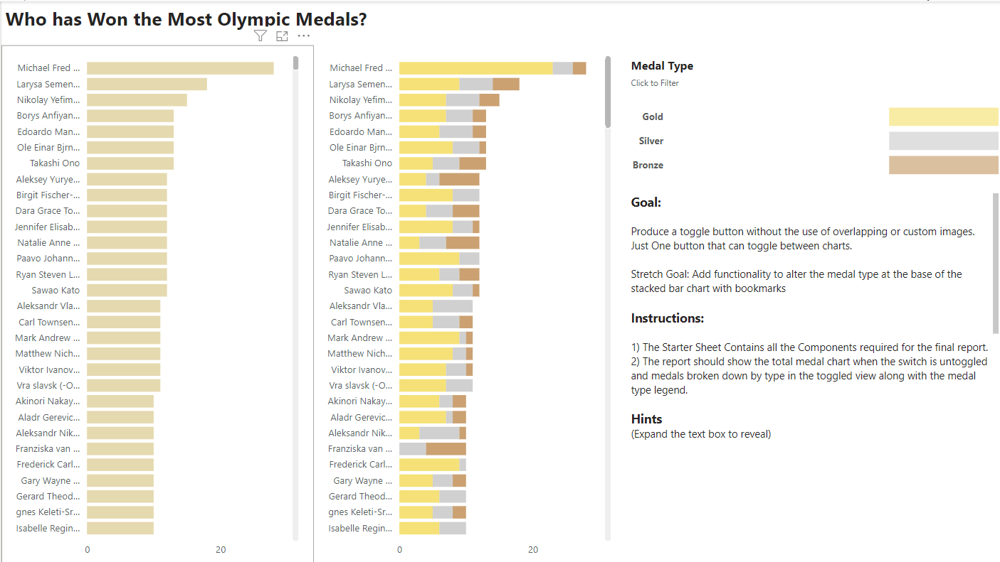
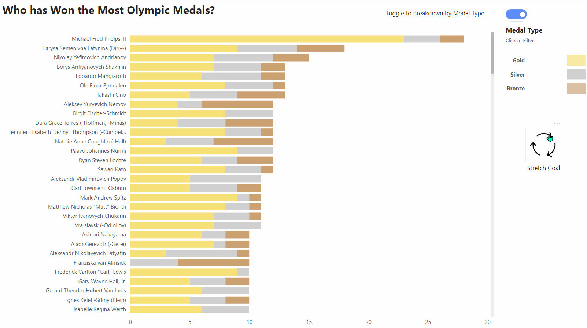

# Power BI Toggle Button Challenge

Welcome to the Power BI Toggle Button Challenge! This README will guide you through the challenge goals, provide the necessary resources to get started, and offer some hints to help you along the way.

## Challenge Goals

- **Primary Goal**: Produce a toggle button without the use of overlapping or custom images. Just one button that can toggle between charts.
- **Stretch Goal**: Add functionality to alter the medal type at the base of the stacked bar chart with bookmarks.

## Before and After

### Before

### After

## Getting Started

To start the challenge, you'll need Power BI Desktop installed on your machine. Follow these steps to get started:

1. **Download the .pbix Files**:
   - Click [here](Toggle_Button_Bookmark_Starter.pbix) to download the Starter Challenge Power BI file.
   - Click [here](Toggle_Button_Bookmark_Solution.pbix') to download the Solution Power BI file.
2. **Open the .pbix Files**: Launch Power BI Desktop and open the downloaded `.pbix` files.
3. **Begin the Challenge**: Use the Starter Sheet, which contains all the components required for the final report, to complete the challenge.

## Instructions

1. **Starter Sheet**: Contains all the components required for the final report.
2. **Report Requirements**:
   - The report should show the total medal chart when the switch is untoggled and medals broken down by type in the toggled view along with the medal type legend.

  
Hints (Expand to reveal)

- In order to configure the button correctly, you will need to use a Group in the bookmark config pane.
- You will need to rename one of the bookmarks using a Unicode character ⬤.
- When configuring the button to work, use FORMAT > SELECTION to bring up a selection window that can help easily configure what is shown and not shown in the bookmarked window.

## Acknowledgements

Thank you for participating in the Power BI Toggle Button Challenge. We hope you find it engaging and educational.

---
