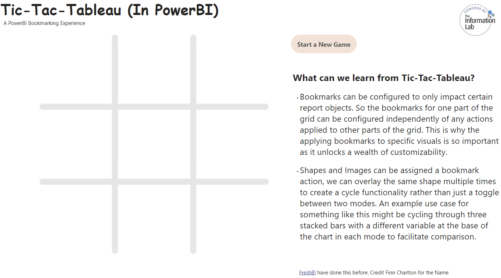

# Tic-Tac-Tableau Dashboard

Welcome to the Tic-Tac-Tableau dashboard project! This README will guide you through the features of our Power BI dashboard, how to navigate it, and provide the necessary resources to get started.

## Features

The Tic-Tac-Tableau dashboard is an interactive visualization created using Power BI's bookmark functionality. Key features include:

- **Interactive Bookmarks**: Navigate through different views and scenarios with the click of a button.
- **Conditional Button Display**: Buttons are layered and displayed conditionally to create a dynamic 'cycle' effect, enhancing the user experience.
- **Shapes and Images**: Bookmark actions are applied to shapes and images, allowing for creative and interactive elements within the dashboard.

## Screenshots

## Getting Started

To start exploring the Tic-Tac-Tableau dashboard, you'll need Power BI Desktop installed on your machine. Follow these steps to get started:

1. **Download the .pbix File**: Click [here](Tic_Tac_Tableau.pbix) to download the Tic-Tac-Tableau Power BI file.
2. **Open the .pbix File**: Launch Power BI Desktop and open the downloaded `.pbix` file.
3. **Interact with the Dashboard**: Use the interactive bookmarks and conditional buttons to explore the different views and insights provided by the dashboard.

## Applying Bookmark Actions

Bookmarks in Power BI can be used to capture the current state of a report page, including filters, slicers, and visual properties. In the Tic-Tac-Tableau dashboard, bookmark actions are applied to shapes and images to enhance interactivity. Here's how you can apply bookmark actions:

1. **Create a Bookmark**:

   - Go to the "View" tab in Power BI Desktop.
   - Click on "Bookmarks Pane".
   - Set up your desired view and click "Add" to create a new bookmark.

2. **Apply Bookmark Actions to Shapes and Images**:

   - Select the shape or image you want to link to a bookmark.
   - In the "Format" pane, go to "Action".
   - Toggle the "Action" switch to "On".
   - Set the "Type" to "Bookmark".
   - Choose the bookmark you created from the "Bookmark" dropdown.

3. **Layering Buttons for Conditional Display**:
   - Create multiple buttons for different states or actions.
   - Use the "Selection Pane" to layer buttons on top of each other.
   - Set the visibility of each button conditionally based on the bookmarks, creating a 'cycle' effect.

By utilizing these techniques, you can create a highly interactive and engaging dashboard.

## Acknowledgements

Thank you for using the Tic-Tac-Tableau dashboard. We hope you find it useful and insightful.

Stephen and I came up with the idea to demo bookmarks this way ourselves but FreshBI had produced it [first](https://community.fabric.microsoft.com/t5/Data-Stories-Gallery/Tic-Tac-Toe-with-Power-BI/m-p/338628).

We also want to thank Finn Charlton for the wonderfully creative name

---
